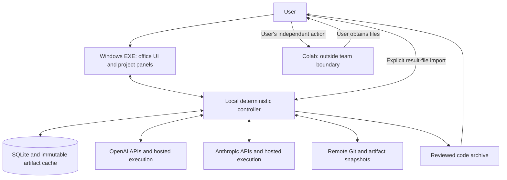

> Historical architecture specification. Current runtime status and superseding constraints: [roadmap status, section 11](../ROADMAP.md#11-execution-checklist-and-progress-record). Fixed-team and API-budget provisions below are not active product defaults.

# Quant Research Office — full architecture 0.3

Status: complete architecture specification for initial implementation; runtime behavior and provider access remain unverified. The user's latest instructions supersede earlier local-web-UI and Colab-integration proposals. This document defines a Windows desktop product for generalized quant model research.

## 1. Product and boundaries

The user launches Quant Research Office.exe, types a research request or opens a project, and directs a visible team. The local app sends versioned task inputs to provider-hosted models and execution environments. Results return as messages, reports and files. The controller validates metadata, records evidence and enforces sequencing; it never performs an agent's scientific work.

| Location | Allowed responsibilities | Excluded responsibilities |
| --- | --- | --- |
| Local device | Desktop rendering, user input, deterministic routing, metadata validation, byte hashing, file transfer, approval bookkeeping, SQLite, usage accounting | LLM inference, agent-authored shell execution, code imports, tests, ML fitting, backtests, scientific/statistical calculations |
| OpenAI infrastructure | GPT role reasoning, hosted coding/testing/calculation, approved research retrieval, bounded task artifacts | Access to the user's device or Colab |
| Anthropic infrastructure | Claude role reasoning, hosted coding/testing/calculation, approved research retrieval, bounded task artifacts | Access to the user's device or Colab |
| Remote Git and artifact storage | Authoritative source/contracts and recoverable evidence snapshots managed by the controller | Autonomous workflow decisions or access to live Colab |
| Colab | The user manually runs finalized ML code outside the team | Any agent/controller connection, launch, login, API, browser action, poll, session or remote control |

Running the signed desktop application itself is ordinary local UI/control execution. It does not grant a model a local execution tool. Neither a model's generated code nor a downloaded research module is executed by the local application.

All final ML training/evaluation in Colab is separate from the team's provider-hosted development and verification. The team may author a static notebook or launcher as a deliverable. Writing a file is not opening or operating Colab. If a hosted runtime lacks a required capability, the task is blocked or assigned to an approved compatible runtime on OpenAI/Anthropic infrastructure. Colab is never an agent execution fallback.

## 2. System diagram



There is intentionally no edge from an agent, adapter, controller or storage connector to Colab. Result analysis uses a copy supplied by the user. Agents cannot follow an imported notebook's Colab links or reconnect to its session.

## 3. Desktop technology decision

Use Electron with TypeScript, React for forms/panels, PixiJS for the office scene, SQLite for durable local state, and Electron Forge for Windows packaging. This replaces the earlier FastAPI plus browser-server suggestion. A single desktop distribution avoids requiring the user to install Python or start a terminal service.

Electron supplies the main/renderer/preload process structure and desktop window lifecycle. The application loads bundled UI assets; the main process exposes only narrow commands through preload IPC. [Electron process model](https://www.electronjs.org/docs/latest/tutorial/process-model)

PixiJS handles 2D rendering for the office. This is a presentation choice; animation never runs or schedules agent work. [PixiJS introduction](https://pixijs.com/8.x/guides/getting-started/intro)

Electron Forge is the chosen build/packaging tool. A clean Windows install receives an installer and an EXE launch entry. Signing, installer verification and update testing are release acceptance items, not features claimed to exist yet. [Electron packaging](https://www.electronjs.org/docs/latest/tutorial/tutorial-packaging)

Initial implementation uses no local web server, no user-accessible shell, no local Python research runtime and no embedded ChatGPT/Claude website automation. Provider integration uses official APIs. UI style draws on [DeskRPG](https://github.com/dandacompany/deskrpg), whose repository describes an office with characters, tasks and meetings. Its existing OpenClaw/browser deployment is not adopted as the agent execution architecture.

## 4. Runtime components

| Component | Location | Input and output |
| --- | --- | --- |
| Office scene and panels | Sandboxed Electron renderer | Read-only state projections; validated user commands |
| Preload bridge | Local packaged application | Typed IPC surface; no general filesystem, network or process API |
| Workflow engine | Electron main process | Validated commands → atomic events and projections |
| Role-context compiler | Controller | Frozen project/task records → scoped provider request bundle |
| Scheduler and budget ledger | Controller | Eligible task queue → reserved provider request; no scientific judgment |
| Provider adapters | Controller transport + hosted provider runtime | Job submission, streams, receipts, exports and usage reconciliation |
| Artifact gateway | Controller | User-selected or provider-returned bytes → staged, hashed inventory |
| Review coordinator | Controller | First reports, disclosure gates, rebuttals and Director packet |
| Storage/snapshot adapter | Controller | Immutable source/contracts/evidence → scoped remote Git/artifact APIs |
| Research package | Provider sandbox; later independent user runtime | Project scientific code and schemas; never a controller import |

The context compiler performs selection and serialization. Any semantic summarization or research interpretation is itself a billed provider task. The local application may render returned tables/charts and sum spend; it does not compute study statistics or regenerate scientific figures.

## 5. Layers and roles

The hierarchy is User → Director → four PM roles → workers. The platform supports multiple research projects; each experiment is a versioned hypothesis and each run is one attempt against a frozen dependency bundle.

| Role | Requested model target | Primary deliverable |
| --- | --- | --- |
| Director | GPT-6 Astra | Research contract, bounded next experiment and evidence-linked decision |
| PM-A: implementation | GPT-5.6 Sol | Integrated package and acceptance mapping |
| PM-B: verification | Claude Opus 5 | Independent correctness/leakage/schema assessment |
| PM-C: findings | Claude Opus 5 | Metric/statistical proposal and evidence-supported findings |
| PM-D: falsification and economics | GPT-5.6 Sol | Counterexamples, alternative explanations and independent economics |
| Workers | Configurable lower-cost provider models | Bounded code, tests, calculations, fixtures or tables |

These are independent, on-demand contexts. Five visible senior desks do not imply five continuously running conversations. There are at most two worker tasks globally, including nested worker-like subtasks. PM-C and PM-D calculations also consume this capacity when delegated to execution workers. A provider harness cannot create unmetered hidden workers.

Model targets are separate from role instructions. API IDs, tool versions and account access are checked during setup and recorded per invocation. A missing target stays unavailable until explicitly changed by the user. No vendor diversity claim substitutes for measured performance on defect fixtures. Detailed authority and review rules are in team-protocol.md.

## 6. General research project interface

A project can investigate forecasts, classifications, asset rankings, volatility/risk models, portfolio construction or other quant methods. Its contract defines hypothesis, output meaning, datasets, selection rules, baselines, model families, evaluation design, metrics, uncertainty, economic scope, exposures and advancement rules.

A ResearchPackage declares:
- Source archive and exact commit, entry-point descriptors and package version.
- Input schemas and manifests, explicit units and provenance.
- Preflight, bounded smoke and full-run interfaces appropriate to its method.
- Environment/dependency lock and required capabilities.
- Required structural/scientific checks, their definitions and expected outputs.
- Result schema, model artifacts where needed, checkpoint dependencies and failure inventory.

These descriptors are data to the controller. Only an approved provider-hosted runner interprets executable entry points during team work. The user separately invokes the exported package in Colab.

Universal platform gates cover identity, review independence, provenance, budget and failure propagation. Scientific checks belong to the frozen project contract. Temporal leakage, market fees, depth, tick metadata, sample size and holdout rules apply when the claim requires them. A non-trading forecast need not supply a trading-fee policy. Applicability must be resolved before freezing; it cannot be changed retrospectively to rescue a failed run.

CatBoost M1 is retained as one example of defect classes and layered review. No fixed asset count, fee formula, OHLCV schema, barrier target or holdout date is built into the platform.

## 7. Authority and prompt routing

A prompt submitted to the Director creates a user message and a proposed research task. The Director produces structured proposals; controller gates determine which proposed actions are permissible. Prose saying a test passed cannot set an execution gate.

Messages sent directly to a PM are scoped to that PM and the selected experiment. A user can inspect worker activity, but a worker's deliverable still routes through its supervising PM. Instructions changing goals, budget, data permissions or scientific policy produce a new recorded scope decision.

Routine repairs under a frozen contract proceed autonomously within file/tool/budget limits. External facts, increased spending boundaries and scientific amendments require the appropriate user decision. PM-A cannot weaken tests while fixing code; PM-B must cite a concrete violation; the Director cannot override a hard validity failure. The application validates authority using the dispatched role/context identity, never a self-declared role in the returned text.

## 8. Data, evidence and approvals

The controller is the single writer of events. Store immutable records and artifacts by SHA-256; source/config/data/test/environment/launcher/package identities form an exact approval bundle. Use canonical JSON for records, byte hashes for files and decimal strings for policy values. URLs are locations, not identities.

Evidence records distinguish CODE_OBSERVED, SYNTHETIC_REPRODUCED, DATA_MEASURED, RUN_MEASURED, USER_REPORTED and ASSUMPTION. Claims link to artifacts and generating procedures. Historical comments and reports retain their original provenance rather than becoming measured facts by repetition.

Approvals bind a project, experiment, purpose and exact dependencies plus applicable verification reports. A changed source, data file, cost rule, metric, environment, notebook or test invalidates dependent approval. Invalidation is appended; previous dissent and decisions stay visible.

Scientific execution evidence has two origins: provider-verified job artifacts and user-imported external-run artifacts. The latter can pass content and consistency checks but is never represented as a directly observed provider execution. Stronger claims require the specified independent reconstruction on provider infrastructure. Hashes alone cannot attest that a computation occurred.

Artifact grants also enforce region and exposure classification before provider transfer. Mixed/unclassified files and protected-derived reports are unavailable under ordinary project grants. Any necessary protected access requires a specific user decision and an exposure event before disclosure; scientific repurposing requires a new contract. Partitioning is user-prepared or separately authorized provider work, never local scientific filtering.

Full-run approval requires accepted compatible smoke evidence or a reviewed launcher that mechanically blocks expensive stages until its smoke passes. This conditional package approval cannot be reported as an already passed smoke. The package uses a finalized payload archive and detached approval envelope to avoid self-referential hashes.

## 9. Persistence, synchronization and restart

Use SQLite with foreign keys, transactions, WAL and one application writer. Atomically append a lineage event, update projections and add snapshot work to an outbox. Unique command IDs plus payload hashes provide replay safety; expected revisions prevent stale approvals.

Local user-data storage contains the database, staged imports, immutable artifact cache and encrypted credential material. Keep project working copies and release binaries separate. No full research dataset is loaded into the desktop's scientific libraries. Large files are streamed and size-limited; remote scientific checks validate their content.

Remote Git stores source/contracts via scoped API operations. A dedicated artifact archive stores results and workflow snapshots. Drive may be configured as an archive only: no live notebook directories, Colab session objects or runtime credentials are attached. When the user returns a Colab output, the app receives it solely through explicit file import. Controller-owned snapshots are distinct from the user's Colab workspace.

A snapshot identifies schema version, last event sequence/hash, immutable records and artifact inventory. A supported restore verifies identities, rebuilds projections and reconciles active provider jobs before dispatch. Hash chains detect inconsistent copies but are not claimed to be tamper-proof against a malicious owner rewriting all copies.

Require a durable snapshot acknowledgment before dependent dispatch, approval disclosure or package release. If the archive bridge fails, preserve pending work locally and block those next steps until recovery. Receiving already-running job outputs and exporting them before expiry is recovery activity, not permission to dispatch new scientific work.

If the desktop is offline, asleep or closed, no new coordination occurs. Already submitted provider jobs can continue within their provider-enforced budget/time bounds. The UI distinguishes unknown status from failure. On reopening, retrieve known job IDs, reconcile outputs and costs, then resume. Never infer that closing the window canceled a remote job.

Each dispatch reserves its maximum enforceable financial liability against task, experiment, project and global ceilings atomically. Planning estimates are displayed separately. Actual reconciled spend plus outstanding liability plus the proposed reservation must remain within every ceiling; unknown bounds block dispatch. This prevents concurrent or disconnected jobs from exceeding a shared limit despite individually reasonable estimates.

## 10. Security and execution enforcement

The renderer has nodeIntegration disabled, contextIsolation enabled and sandboxing enabled. Load only bundled app content, use a restrictive content policy, validate IPC senders and schemas, sanitize rendered Markdown, and deny arbitrary navigation/window creation. These decisions follow [Electron security guidance](https://www.electronjs.org/docs/latest/tutorial/security).

Keep API credentials out of renderer state, prompts, logs and archives. Encrypt local tokens with OS-backed storage using Electron safeStorage; recovery reauthenticates instead of exporting plaintext secrets. OS encryption is protection at rest, not isolation from every process running as the same user. [Electron safeStorage](https://www.electronjs.org/docs/latest/api/safe-storage)

The agent tool catalog has no local shell, filesystem executor, browser automation, desktop control or Colab tool. Local file access is through user selection and fixed transfer operations. Imported scripts/notebooks are data, never executable previews.

Hosted execution uses managed provider sandboxes only. Network access is constrained to the task's approved source/dependency destinations. Colab hosts, control APIs, notebook sessions, Jupyter remote endpoints and runtime credentials are excluded. A code-writing task requiring unrestricted tools that defeat this boundary must remain blocked until a constrained provider environment is verified. Prompt instructions alone are insufficient enforcement.

Archive import rejects traversal, symlinks, duplicate names, decompression bombs and inventory mismatches. Never deserialize pickle or execute embedded HTML/JavaScript. Imported files and retrieved web text are untrusted research inputs, not controller instructions.

## 11. Source layout

```text
apps/desktop/
  main/                 application lifecycle, IPC and provider transport
  preload/              narrow typed command bridge
  renderer/office/      pixel-art office scene
  renderer/panels/      tasks, research, reviews, artifacts and settings
packages/
  contracts/            versioned schemas and canonical identities
  controller/           state machine, authority, review and approval gates
  persistence/          migrations, event store, outbox and restoration
  providers/openai/     inference and hosted-execution adapters
  providers/anthropic/  inference and hosted-execution adapters
  artifacts/            streaming import/export and inventory validation
  scheduling/           capacity, reservations, retry and timeout logic
  role-policies/        Director/PM/worker definitions and context recipes
  research-protocol/    data-only descriptors for project packages
projects/<project_id>/
  project.json
  experiments/<experiment_id>/   frozen contracts and decisions
  source/                        project-owned scientific implementation
  checks/                        independent project fixtures
  schemas/                       project data and result schemas
examples/               optional demonstrations, including CatBoost
tests/                  controller, provider contract and desktop acceptance
release/                remote build definitions and release manifests
```

There is no Colab connector package and no local research executor package.

## 12. Architecture acceptance and remaining setup

The architecture is ready to guide implementation when the following design invariants are carried through:
- A graphical installed EXE controls all normal user workflows without a terminal.
- Every agent inference and executable task is tied to OpenAI/Anthropic-hosted infrastructure.
- Colab is absent from tools, credentials, network destinations and job adapters.
- Two different quant model projects use the same role/controller protocol.
- Original reviews survive disagreement, retry, restart and version changes.
- Hard failures stop expensive work; invalid, inconclusive and valid negative findings remain distinct.
- No downstream coordination or calls occur while awaiting the user's external run.
- A signed release build, actual provider probes and executed acceptance evidence precede claims of operational completion.

Provider credentials/capabilities, budgets, remote storage accounts and the first real research mandate remain setup inputs. They do not require another architecture redesign. See increment-1.md for the implementation and verification sequence.
